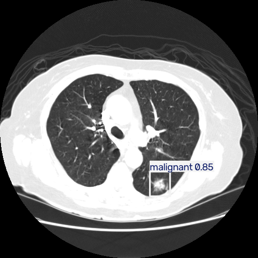

# Pulmonary Nodule Detection and Classification using YOLO11n

A research and educational object-detection project for detecting and classifying pulmonary nodules in CT images using **YOLO11n (Nano)**.

The project includes dataset verification and analysis, model training configuration, final test-set evaluation, performance visualization, single-image inference, and a web-based demonstration application built with Gradio.

> **Research prototype:** This project is intended for research, educational, and demonstration purposes only. It is **not a medical diagnostic tool** and must not be used for clinical decision-making.

---

## Classes

The model predicts three pulmonary nodule classes:

- **Benign**
- **Equivocal**
- **Malignant**

---

## Project Structure

```text
pulmonary-nodule-detection-yolo11/
├── notebooks/
│   └── Pulmonary_Nodule_Detection_Final.ipynb
│
├── app/
│   └── app.py
│
├── results/
│   ├── confusion_matrix.png
│   ├── confusion_matrix_normalized.png
│   ├── BoxPR_curve.png
│   ├── BoxF1_curve.png
│   ├── BoxP_curve.png
│   └── BoxR_curve.png
│
├── examples/
│   ├── dataset_annotations.png
│   ├── test_predictions.png
│   └── single_image_inference.png
│
├── weights/
│   └── README.md
│
├── requirements.txt
├── README.md
└── .gitignore
```

---

## Dataset

The project uses the prepared **LIDC-IDRI CT Lung Detection** object-detection dataset from Roboflow:

https://universe.roboflow.com/lidcidri-detection/lidc-idri-ct-lung-detection-2/dataset/1

The dataset contains CT images with YOLO-format object-detection annotations.

The dataset is not included in this repository because it contains thousands of CT images.

### Dataset structure

```text
LIDC-IDRI-CT-Lung-Detection-2-1/
├── train/
│   ├── images/
│   └── labels/
│
├── valid/
│   ├── images/
│   └── labels/
│
├── test/
│   ├── images/
│   └── labels/
│
└── data.yaml
```

### Dataset split

| Split | Images |
|---|---:|
| Train | **16,354** |
| Validation | **2,672** |
| Test | **1,337** |
| **Total** | **20,363** |

---

## Model

The project uses **YOLO11n (Nano)** for pulmonary nodule object detection and classification.

| Parameter | Value |
|---|---|
| Architecture | **YOLO11n (Nano)** |
| Task | Object detection |
| Number of classes | **3** |
| Training epochs | **50** |
| Image size | **640 × 640** |
| Batch size | **16** |

The notebook contains the training configuration, but training is disabled by default:

```python
RUN_TRAINING = False
```

This prevents an accidental 50-epoch training run when the notebook is opened.

---

## Trained Weights

The trained `best.pt` checkpoint is intentionally **not committed to this repository** because model weights are large.

For the standalone application, place the trained checkpoint at:

```text
weights/best.pt
```

Alternatively, set the `MODEL_PATH` environment variable to another location.

---

## Evaluation

The final evaluation was performed on the provided test split.

### Overall performance

| Metric | Result |
|---|---:|
| Precision | **86.64%** |
| Recall | **72.12%** |
| mAP@50 | **81.85%** |
| mAP@50–95 | **51.59%** |

### Per-class performance

| Class | mAP@50–95 |
|---|---:|
| Benign | **38.57%** |
| Equivocal | **44.89%** |
| Malignant | **71.31%** |

The repository includes the generated evaluation plots in the `results/` directory.

---

## Evaluation Visualizations

The project includes:

- Confusion matrix
- Normalized confusion matrix
- Precision-Recall curve
- Precision-Confidence curve
- Recall-Confidence curve
- F1-Confidence curve

These visualizations are available in:

```text
results/
```

---

## Example Predictions

Representative dataset annotations and model predictions are included in:

```text
examples/
```

These examples demonstrate the model's bounding-box detection and classification results.

---

## Web Application

A Gradio-based web application was developed to demonstrate the trained model interactively.

The application allows users to:

1. Upload a CT image.
2. Select a confidence threshold.
3. Run YOLO11n inference.
4. View detected nodules using bounding boxes.
5. View the predicted class and confidence score.

### Application preview



The application code is available in:

```text
app/app.py
```

---

## Confidence Threshold

The confidence threshold is the minimum confidence required for a detection to be displayed.

For example, with a threshold of `0.50`, detections with confidence below 50% are filtered out.

A higher threshold generally produces fewer, more confident detections, while a lower threshold allows more detections but may include weaker predictions.

---

## Running the Notebook

The notebook was developed for Google Colab.

1. Open `notebooks/Pulmonary_Nodule_Detection_Final.ipynb` in Google Colab.
2. Mount Google Drive.
3. Place the prepared dataset at the configured dataset path.
4. Place the trained `best.pt` checkpoint at the configured model path.
5. Run the notebook cells in order.

The notebook contains the complete workflow:

```text
Dataset
   ↓
Dataset analysis
   ↓
YOLO11n configuration
   ↓
Training configuration
   ↓
Test-set evaluation
   ↓
Performance visualization
   ↓
Inference
```

---

## Running the Web Application

From the repository root:

```bash
pip install -r requirements.txt
python app/app.py
```

By default, the application looks for:

```text
weights/best.pt
```

To use another checkpoint:

```bash
MODEL_PATH=/path/to/best.pt python app/app.py
```

To generate a public Gradio share link:

```bash
GRADIO_SHARE=true MODEL_PATH=/path/to/best.pt python app/app.py
```

---

## Dataset Split

The project uses the prepared train, validation, and test splits provided with the Roboflow dataset.

The reported evaluation metrics therefore describe performance on the provided test split.

---

## Limitations

This project is a **research and educational prototype**.

The model was developed for experimentation and demonstration of pulmonary nodule object detection and classification. The results should not be interpreted as clinical diagnostic performance.

The application is **not a medical diagnostic tool** and must not be used for clinical decision-making.

---

## Technologies

- Python
- YOLO11n
- Ultralytics
- PyTorch
- NumPy
- OpenCV
- Pillow
- Matplotlib
- Gradio
- Google Colab
